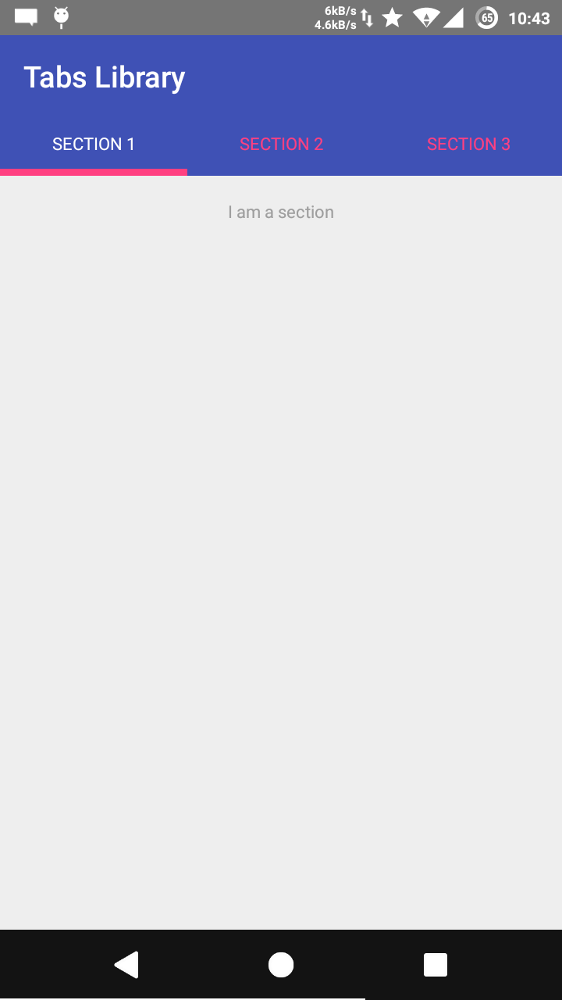

tfTabs
======

A clone of `ActionBarTabs` in Android but is compatible with `Toolbar`

<<<<<<< HEAD
You may get this library by adding the following in the dependency section of your `build.gradle` file:
=======
You may get this library adding the following in the dependency section of your `build.gradle` file:
>>>>>>> d0474e5170a37a6855bdce711d977b238016cba3

    compile 'com.tf.library.tabs:tftabs:1.0.0'

Or you may copy the following files from the given example code into your project:

    src/com.tf.library.tabs.Tab.java
    src/com.tf.library.tabs.TabsHolder.java
    res/layout/tab.xml
    
Add it in your layout xml file:

    <com.tf.library.tabs.TabsHolder
        android:id="@+id/tabs"
        android:layout_width="match_parent"
        android:layout_height="wrap_content" />

Add a few lines in your activity code:

    // Set up the tabs
    final Tabs tabs = (Tabs) findViewById(R.id.tabs);
    tabs.setViewPager(mViewPager);
    
    // Optionally setup the colors
    tabs.setBackgroundColor(getResources().getColor(R.color.primary_material_light));
    tabs.setTitleColor(getResources().getColor(android.R.color.black));
    tabs.setSelectionColor(getResources().getColor(R.color.primary_material_dark));

    // When swiping between different sections, select the corresponding tab.
    mViewPager.setOnPageChangeListener(new ViewPager.SimpleOnPageChangeListener() {
    @Override
        public void onPageSelected(int position) {
            tabs.setCurrentTab(position);
        }
    });
    
And you're done!

**Note**: Before `tabs.setViewPager(mViewPager);` you must have your `FragmentPagerAdapter` in your `ViewPager`

Tags: #ActionBarTab, #Tabs, #Android, #Toolbar, #TabsLibrary
